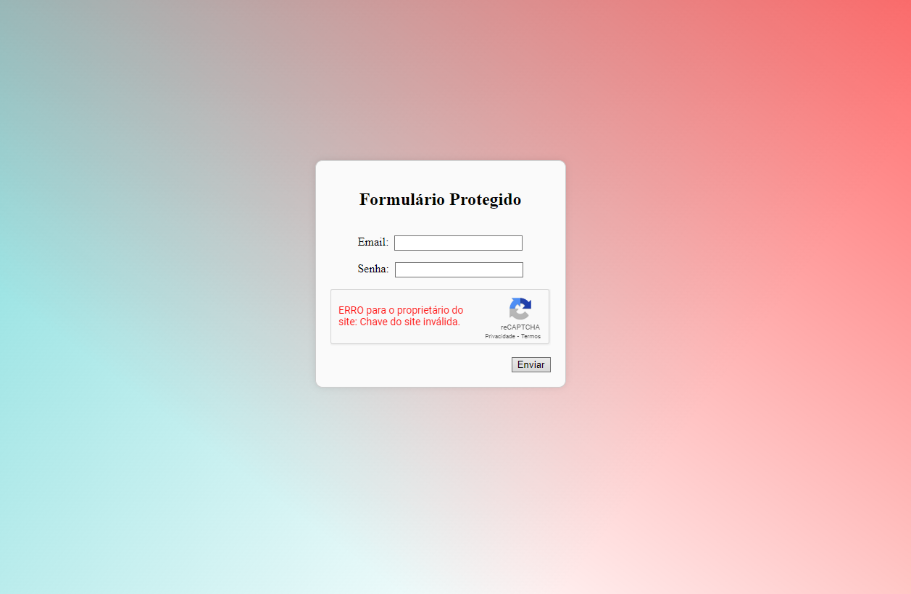

# 7 Formas de melhorar a segurança de seu formulário contra Bots Usando Apenas o Front-End

Imagine que você tenha um site, e precise proteger o envio de formulários, seja para um usuário não enviar diversas requisições manualmente ou um bot malicioso executando diversas requisições.
Se você só tiver acesso ao front-end, há algumas soluções que podem ser implementadas diretamente na interface do usuário para mitigar, ao menos parcialmente, ataques de bots ou requisições abusivas. No entanto, é importante lembrar que soluções exclusivamente no front-end são mais limitadas e não substituem medidas de segurança no back-end. Aqui estão algumas estratégias que podem ser aplicadas:

### 1. **CAPTCHA ou reCAPTCHA**
   - **Como funciona**: CAPTCHA e reCAPTCHA são soluções que forçam o usuário a interagir com um desafio que bots geralmente não conseguem resolver. Isso impede a automação de envios de formulários.
   - **Como implementar**: O Google reCAPTCHA é fácil de integrar em uma página de login ou formulário de inscrição. Com acesso apenas ao front-end, você pode adicionar o widget reCAPTCHA e garantir que ele seja validado antes que o formulário seja enviado.
   - **Exemplo**:
     ```html
     <form action="/submit-form" method="POST">
       <!-- Campos de login -->
       <div class="g-recaptcha" data-sitekey="your-site-key"></div>
       <button type="submit">Enviar</button>
     </form>
     <script src="https://www.google.com/recaptcha/api.js" async defer></script>
     ```

### 2. **Desabilitar o Botão de Envio após o Clique**
   - **Como funciona**: Uma abordagem simples para evitar múltiplos envios rápidos é desabilitar o botão de envio após o primeiro clique.
   - **Como implementar**: No front-end, você pode usar JavaScript para desativar o botão imediatamente após o usuário enviar o formulário, o que ajuda a prevenir bots simples que tentam enviar várias requisições rapidamente.
   - **Exemplo**:
     ```html
     <button id="submitButton" onclick="disableButton()">Enviar</button>
     <script>
       function disableButton() {
         document.getElementById('submitButton').disabled = true;
       }
     </script>
     ```

### 3. **Adicionar Delays entre Requisições**
   - **Como funciona**: Bots geralmente operam muito mais rápido do que humanos. Adicionar um pequeno atraso (delay) no envio de um formulário pode ajudar a evitar requisições automatizadas.
   - **Como implementar**: Use JavaScript para implementar um atraso forçado antes de permitir que o formulário seja enviado.
   - **Exemplo**:
     ```html
     <form id="myForm" onsubmit="delaySubmission()">
       <!-- Campos do formulário -->
       <button type="submit">Enviar</button>
     </form>
     <script>
       function delaySubmission(event) {
         event.preventDefault();
         setTimeout(function() {
           document.getElementById('myForm').submit();
         }, 2000); // 2 segundos de atraso
       }
     </script>
     ```

### 4. **Randomização de Campos HTML**
   - **Como funciona**: Bots geralmente procuram por campos de formulário predefinidos (como `name="email"` ou `name="password"`). Mudando dinamicamente esses valores ou adicionando campos de "honeypot", você pode dificultar a vida dos bots.
   - **Como implementar**: Um exemplo simples é incluir um campo oculto que os humanos não preencherão, mas os bots possivelmente preencherão, já que eles tendem a completar todos os campos visíveis e invisíveis.
   - **Exemplo**:
     ```html
     <form id="myForm" onsubmit="checkHoneypot()">
       <!-- Campos de login -->
       <input type="text" name="honeypot" style="display:none">
       <button type="submit">Enviar</button>
     </form>
     <script>
       function checkHoneypot(event) {
         var honeypot = document.getElementsByName('honeypot')[0].value;
         if (honeypot !== "") {
           event.preventDefault(); // Previne o envio se o campo oculto for preenchido
         }
       }
     </script>
     ```

### 5. **Uso de `localStorage` para Limitar Requisições**
   - **Como funciona**: Você pode usar `localStorage` ou `sessionStorage` no navegador para rastrear quantas vezes o formulário foi enviado em um curto período de tempo e, assim, limitar a frequência de envios.
   - **Como implementar**: Armazene um contador no `localStorage` e bloqueie envios excessivos baseados nesse contador.
   - **Exemplo**:
     ```html
     <form id="myForm" onsubmit="limitSubmissions(event)">
       <!-- Campos do formulário -->
       <button type="submit">Enviar</button>
     </form>
     <script>
       function limitSubmissions(event) {
         let count = localStorage.getItem('submitCount') || 0;
         if (count >= 3) {
           alert('Você atingiu o limite de tentativas. Tente mais tarde.');
           event.preventDefault();
         } else {
           localStorage.setItem('submitCount', ++count);
           // Adicione um temporizador para limpar após um tempo
           setTimeout(() => localStorage.setItem('submitCount', 0), 60000); // Limpa em 1 minuto
         }
       }
     </script>
     ```

### 6. **Obfuscação de Código JavaScript**
   - **Como funciona**: Bots mais sofisticados podem tentar analisar o código JavaScript da página. Obfuscar o código dificulta a engenharia reversa por parte dos bots.
   - **Como implementar**: Use ferramentas de obfuscação de JavaScript, como o [JavaScript Obfuscator](https://javascriptobfuscator.com/) para proteger o código. Porém, é importante lembrar que isso não é uma solução definitiva e apenas adiciona uma camada extra de dificuldade.

### 7. **Verificação de Eventos Human Interaction**
   - **Como funciona**: Bots tendem a simular interações de clique e não reproduzem interações humanas naturais como o movimento do mouse.
   - **Como implementar**: Você pode adicionar um listener para monitorar eventos de interação genuínos, como o movimento do mouse ou a rolagem da página.
   - **Exemplo**:
     ```html
     <button type="submit" id="submitButton" disabled>Enviar</button>
     <script>
       let isHuman = false;
       document.addEventListener('mousemove', () => {
         isHuman = true;
         document.getElementById('submitButton').disabled = false;
       });

       document.getElementById('myForm').addEventListener('submit', function(event) {
         if (!isHuman) {
           event.preventDefault(); // Bloqueia o envio se nenhum movimento humano for detectado
           alert('Movimente o mouse antes de enviar o formulário');
         }
       });
     </script>
     ```

Essas soluções no front-end ajudam a mitigar problemas causados por bots, mas sempre que possível, uma abordagem completa envolvendo o back-end é ideal.


## Exemplo de fomulário:

